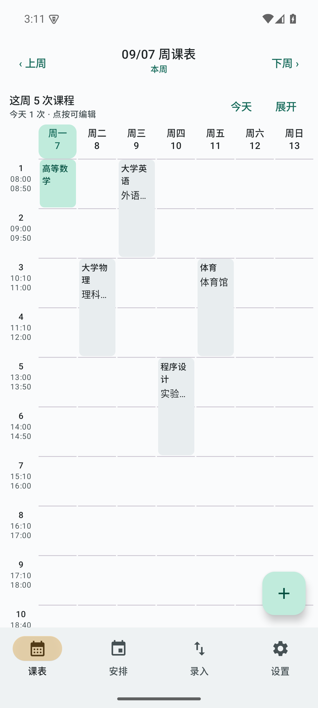
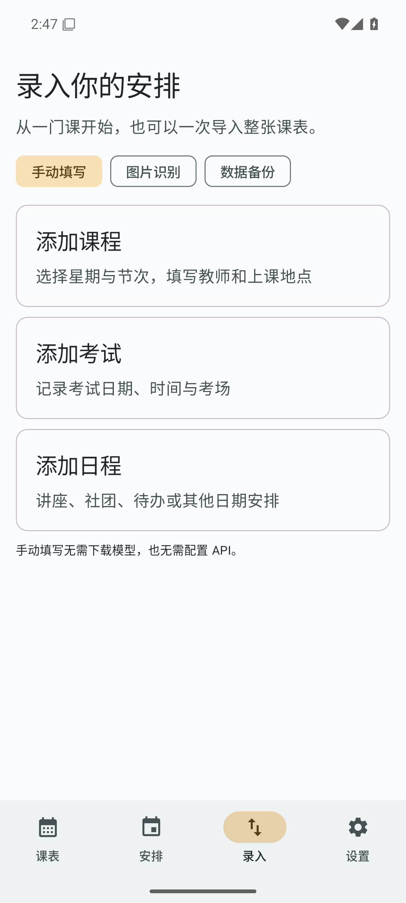
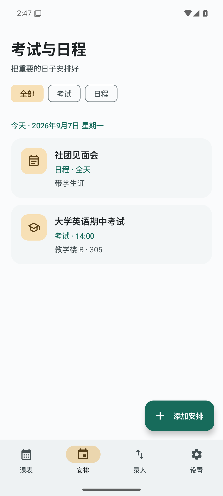

# 我的课表（Class Schedule）

一个面向 Android 的原生课表应用，同时保留可离线使用的 Web/PWA 版本。

[下载 APK](https://github.com/RTXwcz/Class-Schedule/releases/latest) · [使用与构建文档](docs/README.md) · [提交问题](https://github.com/RTXwcz/Class-Schedule/issues) · [GPL-3.0-only](LICENSE)

  

## 功能

- 整周概览与展开课表、考试/日程分类、可选单双周和明确周次计算
- 自定义每天 1–48 节及每节起止时间；连堂课程显示为一张跨节次卡片
- 指定日期按目标星期替换的整天调休规则
- 上课前提醒（默认 10 分钟），支持精确闹钟、重启和时区变化后恢复
- Android 桌面小组件：显示最近三节课、时间和教学楼/教室
- Room 本地存储、JSON 完整导入导出、数据集版本和来源元数据
- 手动填写课程、考试或日程，也可使用图片或 JSON 导入
- PP-OCRv6 tiny/small 本地中文 OCR；从 hf-mirror.com 主动下载，识别结果逐项确认后写入
- OpenAI Chat Completions 兼容的图片导入，可配置 API 地址和模型
- 局域网 MCP（Streamable HTTP）：查询、添加、修改和删除课程/考试/调休
- 原生 Kotlin + Jetpack Compose 界面；Web/PWA 作为独立入口保留

## 下载与安装

首个版本：[v1.3.0](https://github.com/RTXwcz/Class-Schedule/releases/tag/v1.3.0)。提供两个独立的正式签名 APK，要求 **Android 7.0（API 24）及以上**：

| 文件 | 适用设备 |
| --- | --- |
| [arm64-v8a（ARMv8，推荐）](https://github.com/RTXwcz/Class-Schedule/releases/download/v1.3.0/class-schedule-v1.3.0-arm64-v8a.apk) | 大多数现代 Android 手机的 64 位系统 |
| [armeabi-v7a（ARMv7）](https://github.com/RTXwcz/Class-Schedule/releases/download/v1.3.0/class-schedule-v1.3.0-armeabi-v7a.apk) | 使用 32 位 ARM Android 系统的设备 |

不再提供 x86/x86_64 或通用 APK。Release 附带 SHA-256 校验文件和 ARM 打包配置对应的源码包。

如果此前安装的是 debug APK，签名与首发版不同：请先导出 JSON 备份，再卸载旧版、安装首发版并导入备份；正式版之间可使用同一签名升级。

APK 不包含 OCR 权重。首次在设置中选择并点击下载后，模型保存到应用私有目录；不需要本地 OCR 时不会产生模型下载。

## 从源码构建 Android

环境：Android Studio、JDK 21、Android SDK Platform 36、Node.js 22 或更高版本。先安装锁定的依赖并生成 Capacitor 桥接配置，再打开 `apk/android`。Windows PowerShell 示例（JDK 路径按本机调整）：

```powershell
$env:JAVA_HOME = 'C:\Program Files\Microsoft\jdk-21.0.12.101-hotspot'
cd apk
npm ci
npm run sync
cd android
./gradlew.bat :app:assembleDebug
```

产物位于 `apk/android/app/build/outputs/apk/debug/`，分别为 `app-arm64-v8a-debug.apk`、`app-armeabi-v7a-debug.apk`。中文路径下建议使用 ASCII junction 构建，完整说明见 [`apk/构建APK.md`](apk/构建APK.md)。

运行 JVM 测试：

```powershell
./gradlew.bat :app:testDebugUnitTest
```

运行 Web 契约测试：

```powershell
node --test tests/schedule-contract.test.cjs
```

## 使用说明

1. 新安装默认关闭单双周；需要时在设置中开启并填写学期开始日期，第 1、3、5 周为单周，第 2、4、6 周为双周。关闭开关保留原规则，按每周显示；明确的周次范围仍按学期日期计算。旧版已有设置会保留原先启用状态。
2. 课程地点分为教学楼、教室和地点备注。调休规则指定日期与目标星期后，当天自动使用目标星期的课程。
3. MCP 默认关闭。开启后，在局域网 Agent 中使用设置页显示的 IPv4 地址和 `/mcp`，并携带 `Authorization: Bearer <Token>`。
4. Web 版入口是根目录 [`课表.html`](课表.html)，也可以部署到 GitHub Pages。Web 的 [`schedule-contract.js`](schedule-contract.js) 与原生 `JsonScheduleCodec` 实现同一套 JSON 交换格式。
5. 进入“录入”选择手动填写、图片识别或数据备份。“安排”可分别查看考试与日程，并编辑日期、时间、地点和备注。
6. 在“设置 → 每日作息”编辑每天节数及各节的 `HH:mm` 起止时间。时间按先后排列且不重叠；跨多节的课程填写开始和结束节次，界面自动连成一块。减少节数前需先调整超出范围的已有课程。

## 仓库结构

```text
apk/android/       原生应用、领域规则、数据库、测试及 Gradle Wrapper
apk/www/           Web 镜像（由 tools/sync-web.ps1 同步）
docs/              文档索引、研究、设计记录、验证截图、参考资料
licenses/          第三方许可全文及运行时依赖声明
tools/             Web 同步、许可汇总和签名构建脚本
tests/             Web 数据契约测试
课表.html          Web 主页面
schedule-contract.js  Web 数据交换与日期规则
```

## 架构

```text
Compose UI -> AppViewModel -> ScheduleRepository -> Room
                     |              |
                     |              +-> ReminderCoordinator / Glance Widget
                     +-> OCR/OpenAI -> CourseDraft -> 逐项确认
                     +-> MCP Server -> ToolRegistry -> Repository
```

领域规则集中在 `ScheduleResolver`：课表界面、提醒、小组件和 MCP 都使用同一套日期、周次、单双周和调休逻辑。OCR 采用官方 PaddleOCR Android 代码的固定版本，修改和来源记录见 `apk/android/app/src/main/java/com/kebiao/app/ocr/paddle/UPSTREAM.md`；权重不随仓库发布。

## 开源协议与第三方许可

本项目自有代码以 **GNU General Public License v3.0 only** 发布，详见 [`LICENSE`](LICENSE)。分发或修改 Android 应用时，请同时提供对应源代码并保留版权与许可声明。

仓库还包含第三方组件：PaddleOCR Android 源码为 Apache-2.0（目录内保留原许可证），AndroidX、ONNX Runtime、OpenCV、Ktor、Kotlin 和 Capacitor 各自遵循其上游许可证。第三方许可证不因本项目的 GPL 声明而改变，详见 [第三方声明](THIRD_PARTY_NOTICES.md)。应用设置内可离线查看 GPL 全文及依赖许可。

## 验证状态

已在 Android 15 模拟器完成 Room 迁移、提醒、小组件、MCP、tiny/small OCR 下载及中文推理、原生 UI 和 Web 契约测试。真实手机的厂商后台策略、通知准点率、真实课表识别准确率和实际 OpenAI 请求仍需使用者自行验收。详细记录见 [`docs/superpowers/verification/2026-09-07-native-final-verification.md`](docs/superpowers/verification/2026-09-07-native-final-verification.md)。

## 贡献

欢迎提交 Issue 和 Pull Request。涉及课程数据格式、OCR 字段或 MCP 工具时，请同步更新测试和文档。
