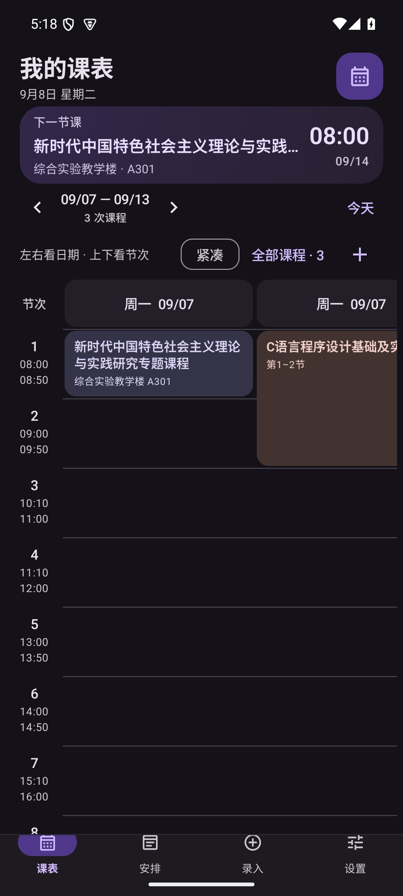

# 我的课表 · Class Schedule

把下一节课、考试和重要日程，放在随手可见的地方。

Android 原生课表应用，支持自定义作息、连堂课程、桌面小组件、图片识别和 AI 助手接入。无需注册账号，保留独立 Web/PWA 版本。

[下载应用](https://github.com/RTXwcz/Class-Schedule/releases/latest) · [使用指南](docs/USAGE.md) · [问题反馈](https://github.com/RTXwcz/Class-Schedule/issues) · [GPL-3.0](LICENSE)

**v1.5.2** 收紧课表间距，紧凑档以更窄列宽折行显示，底部导航更简洁；左右滑动看日期、上下滑动看节次。[查看效果与验证](docs/product/1.5.2/VERIFICATION.md)



## 课表，按你的节奏

- **可选配色**：在设置中选择松林绿或鸢尾紫，各自支持跟随系统、浅色和深色；小组件同步配色。
- **一眼看到下一节课**：首页展示时间和地点；课表采用固定列宽，横向浏览日期、纵向浏览节次，星期与时间刻度固定保留。
- **自定义每天的作息**：设置 1–48 节和各节起止时间。连上多节的课程显示为一张连续卡片。
- **自然地选择日期和时间**：学期、调休、考试、日程和作息使用滚轮选择，自动处理月份天数与闰年。
- **规则随学校安排**：支持指定周次、可选单双周，以及某个日期改上另一星期课程的整天调休。
- **记录永远能找到**：全部课程入口可管理暂未生效的课程；考试与日程支持分类查看、编辑和删除。
- **上课前提醒**：默认提前 10 分钟，桌面小组件展示最近三次课程；时间计算使用同一份作息与调休规则。

## 选择适合你的录入方式

| 方式 | 适合的场景 |
| --- | --- |
| 手动填写 | 逐门添加课程，或记录考试、活动和个人日程 |
| 本地图片识别 | 下载 PP-OCRv6 tiny（约 6.3 MB）或 small（约 31.2 MB）后，在手机上识别图片 |
| OpenAI 兼容接口 | 配置自己的 API 地址、模型与 Key，使用云端视觉识别 |
| JSON 备份与恢复 | 在设备之间、原生版与 Web 版之间迁移完整课表 |

本地模型只在主动选择下载后获取，使用 `hf-mirror.com`，并校验固定版本的大小与 SHA-256。图片识别后，每门课程默认折叠展示摘要；展开即可编辑，底部“应用识别结果”一次追加全部有效课程。缺少必填信息时可直接定位，不再逐字段勾选。统一周次仅改动主动选择的内容，移除可撤销。完整备份包含课程、考试、日程、调休、学期与作息，恢复时作为一个数据集提交。

## 安装

系统要求：**Android 7.0（API 24）及以上，ARM 设备**。

| 安装包 | 选择建议 |
| --- | --- |
| [arm64-v8a / ARMv8](https://github.com/RTXwcz/Class-Schedule/releases/download/v1.5.2/class-schedule-v1.5.2-arm64-v8a.apk) | 推荐，适用于大多数现代 Android 手机的 64 位系统 |
| [armeabi-v7a / ARMv7](https://github.com/RTXwcz/Class-Schedule/releases/download/v1.5.2/class-schedule-v1.5.2-armeabi-v7a.apk) | 适用于 32 位 ARM Android 系统 |

当前 APK 大小约 **45.16 MiB（ARM64）/ 32.61 MiB（ARMv7）**。模型、课表数据、缓存和系统优化文件另计，不同设备统计会有差异。

Release 同时提供源码包和 `SHA256SUMS.txt`。发布包不包含 x86/x86_64，也不包含 OCR 模型权重。

正式版本使用同一签名，可覆盖升级。若此前安装的是 debug 包，请先导出 JSON，再卸载 debug 包、安装正式版并恢复备份。**卸载会删除应用本地数据。**

## 连接 AI 助手

在 **设置 → AI 连接** 按三步引导操作：连接同一个可信 Wi-Fi，开启手机服务，再将连接地址和 Token 填入支持 Streamable HTTP 的 MCP 客户端。应用提供地址、Token 和完整 JSON 模板的复制按钮。

Agent 可以查询和编辑课程、考试、日程及调休。默认每次修改都需在应用确认，可自行改为配对后直接编辑；清空数据始终需要确认。Token 可以轮换，服务可随时停止。详见 [MCP 连接指南](docs/MCP.md)。

## 数据与隐私

- 课表保存在设备的应用数据库中；正常课表数据可能参与 Android 系统备份，具体由设备设置决定。
- 本地 OCR 在模型下载完成后可离线运行。使用云端识别时，所选图片会发送到你配置的 API 服务，可能产生该服务的费用。
- API Key 和 MCP Token 在本机使用 Android Keystore 加密存储，并排除在应用备份之外。
- MCP 默认关闭，使用局域网 **HTTP，未提供传输层加密**，只应在可信网络中启用。
- 导出的 JSON 是明文课表文件，请按其中的信息内容妥善保管。

## 开发与验证

原生端采用 Kotlin、Jetpack Compose、Room、DataStore 和 Glance。影响课表解释的规则与课程记录在同一数据库事务中保存；界面、提醒、小组件和 MCP 读取同一权威数据集。

```powershell
# JDK 21、Android SDK 36
cd apk/android
./gradlew.bat :app:testDebugUnitTest :app:assembleDebug :app:lintDebug
```

Android 工程直接使用 Gradle 构建，不依赖 Node.js 或 Capacitor 同步。Web 回归需 Node.js 22+，在仓库根目录运行 `node --test tests/*.test.cjs`；生成图标所需的可选 npm 工具见构建文档。

构建和签名说明见 [构建文档](apk/构建APK.md)，协作约定见 [贡献指南](CONTRIBUTING.md)。自动检查由 [GitHub Actions](https://github.com/RTXwcz/Class-Schedule/actions/workflows/android.yml) 执行。版本变化见 [CHANGELOG](CHANGELOG.md)，独立审查和修复证据见 [审查记录](docs/reviews/README.md)。

v1.5.0 的界面与主题在 Android 7.0 和 15 模拟器验证。历史版本的 Android 16 正式 ARM64 包验证保留在对应版本记录中。v1.4.2 中，tiny 与 small 对一张人工核对的真实课表，均正确输出 30 条课程的名称、星期和节次；这不代表广泛课表样本的准确率。尚未验证红米 K90 Pro Max／澎湃 OS 4／Android 17，也未测量厂商设备的长期提醒准点率；复杂或模糊图片仍需手动校对。作息不支持单节跨午夜，跨午夜的提前提醒可以正常计算。

## 开源协议

项目自有代码采用 **GPL-3.0-only**，见 [LICENSE](LICENSE) 与 [NOTICE](NOTICE)。第三方代码保留各自的版权和许可证，见 [第三方声明](THIRD_PARTY_NOTICES.md)。应用内可离线查看许可全文。
