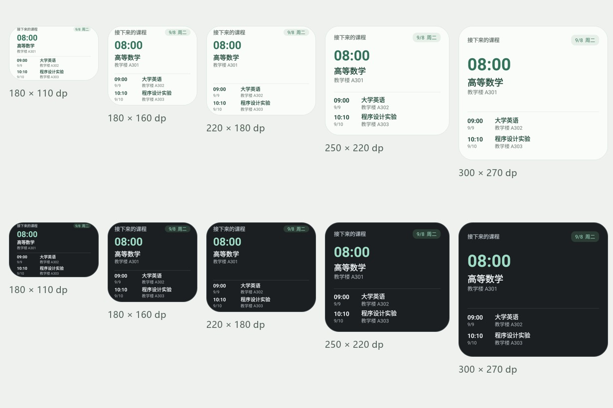

# v1.4.2 验证记录

本次修复针对桌面组件点击、不同尺寸布局、OCR 校对导航、折行课程解析与安装包冗余。记录日期为 2026-09-08。下列结果来自本地构建、自动回归和模拟器实际操作，不把静态审查或系统版本声明当作兼容性证据。

## 组件与交互



图片使用演示课程，由真实 Glance RemoteViews 渲染。五种尺寸为 180×110、180×160、220×180、250×220、300×270 dp，每种均保留标题、日期、首课大时间/名称/地点、分隔线与后两课。30 个组合覆盖五种尺寸、明暗主题、普通名称/长中文名称/空状态，在 Android 7.0 与 15 均通过。

检查包括实际字体行高、父容器裁切、主次字号、文字顺序、日期/地点、分隔线像素、圆角透明度和完整无障碍名称。最小尺寸信息密集，长名称会横向省略；放大后获得更宽松的阅读空间。此轮字体缩放为系统默认 1.0，不代表所有字体缩放和厂商桌面网格都已覆盖。

Android 15 的真实 Launcher 测试包含应用进程不存在时点击空组件、应用仍在后台时重复点击。两者均进入“录入 → 手动填写”，点击“添加日程”可打开编辑表单。有课内容继续进入课表。目标使用显式 MainActivity PendingIntent，并按 Android 15/16 的后台 Activity 启动规则设置 creator 选项。

校对页工具栏和系统返回均保留当前应用会话中的修改，回到导入页后可继续校对；独立放弃按钮需确认，取消放弃后内容仍在。ViewModel 和界面均阻止新识别覆盖已有草稿。未保存的草稿不保证跨进程恢复。

## OCR 验证

对用户提供的一张 838×455 真实课表，人工核对出 30 条课程安排。通过本地私有 `ocr-expected.json` 对 tiny 与 small 分别比较完整课程名、星期及开始/结束节次，均通过；仅统一全半角、Unicode 等价字符和空格，不忽略内容差异。该图片包含不等宽星期列、折行长标题、同一单元格多门独立课程和不同节次跨度。

修复使用实际格线确定闭合单元格，通过行位置推导完整节次；折行标题按同格、位置和文字续接证据处理。低分辨率图片中的低置信字符使用第二种尺度复核，同时保留原始几何和可靠表头。不同尺度有字符分歧时继续提示校对。无法确认格线或缺失表头时保留未知字段。

另有合成回归覆盖无格线、断边、文字跨格、暗底亮格、缺失星期、独立短课程、嵌套括号和跨行候选复用。真实图片未提供的教师、周次、地点不作为已识别字段。

这是单张真实样本的回归证据，不是广泛课表数据集的准确率基准，也不保证任意图片零错误。公开仓库不包含用户原图、人工预期文件或原始识别输出。

## Android 版本矩阵

| 环境 | 产物与已执行范围 | 结果 |
| --- | --- | --- |
| Android 7.0 / API 24 | x86_64 调试包；Widget PendingIntent 导航、OCR 返回/放弃、5 项格线测试、MCP 协议/鉴权/确认写入、4 项提醒集成，共 13 项；另外 30 场景组件渲染 | 全部通过 |
| Android 15 / API 35 | x86_64 调试包；上述功能、真实图 tiny/small 预期字段断言；真实桌面冷/热启动；最终 30 场景渲染及返回、双模型回归 | 全部通过 |
| Android 16 / API 36 | 正式签名且经过 R8 的 ARM64 包，模拟器 ARM 转译；实际下载 tiny/small、DocumentsUI 选图、两者各得到 30 条校对结果、完整折行标题、页面/系统返回及独立放弃；MCP 运行与覆盖升级 | 通过 |
| 红米 K90 Pro Max / 澎湃 OS 4 / Android 17 | 用户报告的设备，本地没有对应厂商镜像或实体设备 | 尚未验证 |

Android 16 正式包 MCP 验证包括 initialize、12 个工具枚举、错误 Token 返回 401、外来 Origin 返回 403、应用确认后的课程写入与 Room 读回。覆盖最终 APK 后数据与两套模型保留，MCP 再次验证通过。未把模拟器 ARM 转译当作 ARM 实体硬件性能测试；未测量厂商长期提醒准点率。

## 体积与发布产物

| 指标 | v1.4.1 | v1.4.2 |
| --- | ---: | ---: |
| ARM64 APK | 60.72 MiB | 45.13 MiB |
| ARMv7 APK | 48.17 MiB | 32.57 MiB |
| ARM64 ZIP 内容解压合计 | 101.31 MiB | 49.46 MiB |
| DEX 解压大小 | 54.93 MiB | 约 5.78 MiB |

APK 大小使用文件字节数除以 2²⁰；ZIP 解压大小是条目合计，不等于 Android 设置的安装空间。Android 16 在两套模型均下载后的系统页面显示：应用 53.61 MB、用户数据 38.00 MB、缓存 786 kB、合计 92.40 MB。设备、系统优化文件和统计口径会影响数值。[系统存储页面](storage-api36.png)。

删除的冗余包括旧 Capacitor/Cordova 运行时、旧模板 FileProvider、未使用的类/资源，以及 APK 内的 Web 副本。ONNX Runtime 和 OpenCV 是离线 OCR 所需，保留 JNI 边界；模型权重仍不随 APK 打包。原生工程直接 Gradle 构建，独立 Web/PWA 与可选图标工具继续保留。

两个正式包仅包含对应的 arm64-v8a / armeabi-v7a 原生库，不提供 x86、x86_64 或 universal APK。两包通过 apksigner 验证并沿用 v1.4.1 的签名证书，版本为 1.4.2 / code 8；ARM64 通过 16 KiB ZIP 对齐检查。签名证书 SHA-256：`46b577174c196e386848e9a44815d0aba635555ba57b0cd74ef1ac1bde99339f`。

## 自动检查与复现

90 项 Kotlin 单元测试、11 项 Web 回归通过，正式签名构建与 Release Lint 通过。Android 7/15 的设备自动回归采用普通调试包；混淆测试框架自身裁剪问题没有作为应用运行结论，R8 功能证据来自 Android 16 的实际正式 APK 操作。

```powershell
# apk/android，JDK 21 + Android SDK 36
./gradlew.bat :app:testDebugUnitTest --no-daemon --console=plain
./gradlew.bat :app:assembleDebug :app:assembleDebugAndroidTest -PlocalUiQa=true --no-daemon --console=plain
# 仓库根目录，Node.js 22+
node --test tests/*.test.cjs
```

`localUiQa` 只允许显式 debug/clean 任务，公开 ARM 构建不传该选项。真实图片诊断需主动向测试设备应用外部目录提供 `ocr-repro.jpg`；可同时提供人工核对的 `ocr-expected.json`，否则该测试仅输出诊断、不证明字段准确性。

主要回归源码：[WidgetClickTest](../../../apk/android/app/src/androidTest/java/com/kebiao/app/widget/WidgetClickTest.kt)、[WidgetRenderTest](../../../apk/android/app/src/androidTest/java/com/kebiao/app/widget/WidgetRenderTest.kt)、[ImportReviewNavigationTest](../../../apk/android/app/src/androidTest/java/com/kebiao/app/ui/ImportReviewNavigationTest.kt)、[LocalImageDiagnosticTest](../../../apk/android/app/src/androidTest/java/com/kebiao/app/ocr/LocalImageDiagnosticTest.kt)。本地日志位于被 Git 忽略的 `apk/android/build/`，公开截图只含演示数据。
