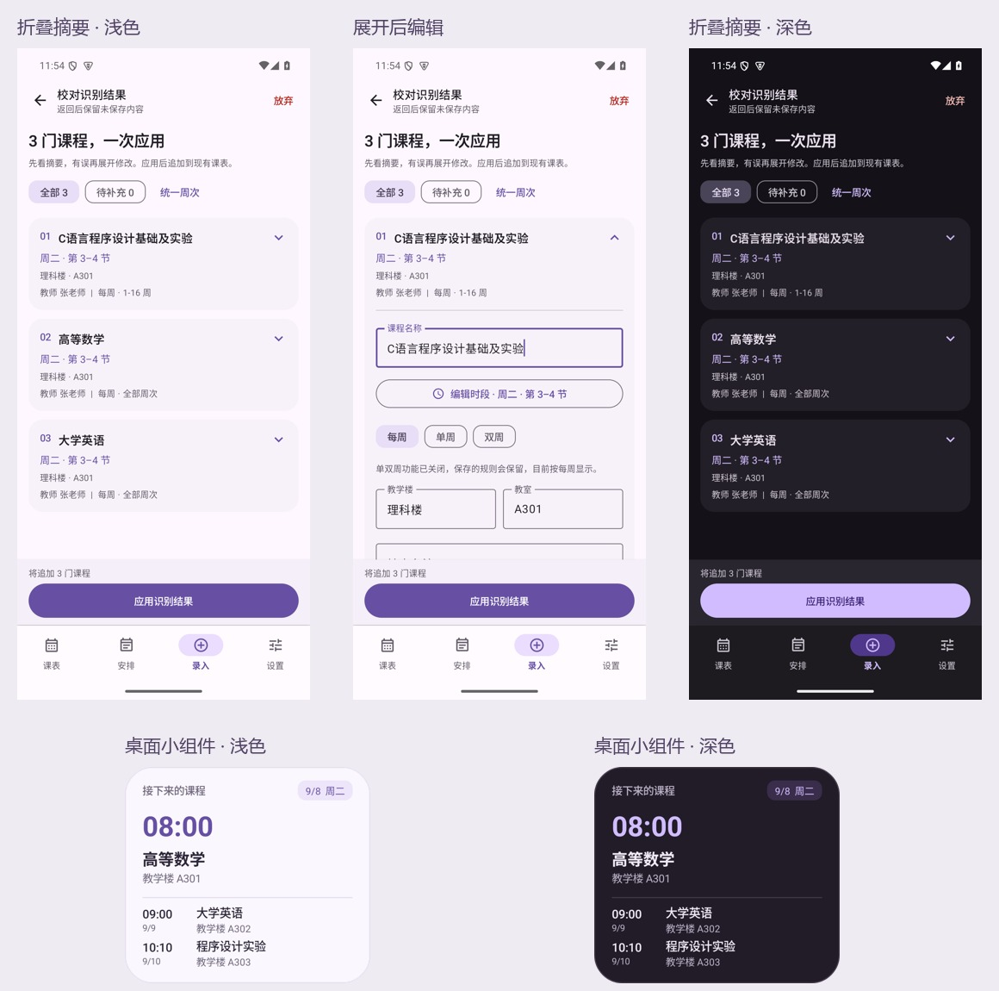

# v1.5.0 操作与主题验证

本次围绕“查看识别摘要 → 必要时修改 → 一次应用”重新整理录入，并检查四个主页面及常用编辑器的操作效率。新增的鸢尾紫配色覆盖浅色、深色、下一节课面板及桌面小组件。日期：2026-09-08。

以上截图来自实际 Compose 页面与 Glance RemoteViews，使用演示课程，不含用户原始课表。

## 识别结果的操作变化

1. 进入校对页，各门课程默认折叠，直接看到名称、时段、地点、教师、周次和备注摘要。
2. 点击课程展开，修改单个字段或打开三列时段滚轮；不再逐字段勾选。图像只在需要时展开查看。
3. “统一周次”默认保留每门课程已有规则和范围，只改动主动选择的内容；单周和双周不会因只填写范围而被统一成每周。
4. 底部应用按钮固定可见。缺少必填信息时定位待补充课程；填写过程中已展开项保留，避免刚改完字段就消失。选填字段可留空，低置信提示不再作为勾选门槛。
5. 一次应用将全部有效课程追加到现有课表。30 门课程实测一次写入 Room；再次触发同批回调不重复追加。已放弃和过期草稿也不能通过旧回调保存。
6. 最近一次移除支持撤销，返回图片页再继续校对仍可恢复；整体放弃仍需要明确确认。草稿与撤销保存在当前 ViewModel 会话，不承诺进程结束后恢复。

旧流程最多要求每门课程 11 个字段确认，30 门课程可产生 330 次额外勾选。新流程在数据有效时只需点击一次应用；这描述的是操作数量变化，不是未经测量的耗时或 OCR 准确率提升。

## 额外效率审查与修复

| 触发路径 / 发现 | 修改与证据 |
| --- | --- |
| 录入跳到设置再返回，或在主 tab 间切换 | 页面状态持有器保留录入模式、筛选、设置分区和可保存的滚动位置；实际切页回归通过 |
| 过去记录很多时查找明天安排 | 今天与未来优先，历史独立展开；30 条历史 + 1 条未来的首屏回归通过 |
| 改时段后按返回，值已被改变 | 弹层独立暂存，确定后才提交；取消、系统返回、滚动期间不可提交回归通过 |
| 全天开关往返导致时间重置 | 分离全天状态与已选时间；14:35 往返后保存仍为 14:35 |
| 从全部课程修改后列表位置丢失 | 保存/取消/删除回到原列表，30 门课程滚到后部再编辑的回归通过 |
| 手动填写时误触系统返回或遮罩 | 实际有修改时提供继续编辑或放弃；未修改、正常保存和显式取消维持直接操作 |

每日节数和调休星期选择也接入滚动状态门控，避免未停稳便提交。MCP 本轮检查了既有分步配置与复制入口，未为没有证据的问题增加新的操作步骤。

## 紫色主题

“松林绿 / 鸢尾紫”与“跟随系统 / 浅色 / 深色”独立选择，配色由 DataStore 保存。缺省或未知配色回退绿色，不改变旧安装默认外观。主题测试覆盖持久化、恢复、切页保留和未知值。

紫色浅色主色为 #6750A4，深色主色为 #D0BCFF，正文、按钮和关键容器对比度均通过至少 4.5:1 的自动检查；首课渐变在两端点分别检查。该检查不等同于完整无障碍认证。

两种配色的小组件均使用既有五种尺寸，分别覆盖明暗、普通名称/长名称/空状态，共 60 场景，通过文本裁切、布局顺序、主次字号、日期地点、分隔线和圆角检查。组件配色随应用选择更新，明暗继续跟随系统。

## 执行范围与结果

| 环境 / 检查 | 范围与结果 |
| --- | --- |
| Kotlin 单元测试 | 99 项通过，包括保存契约、旧回调、数据校验和紫色对比度 |
| Android 15 / API 35 调试包 | 15 项效率交互通过；5 项主题、布局、组件和点击检查通过，组件测试内部覆盖 60 场景 |
| Android 7.0 / API 24 调试包 | 17 项新版交互及主题设置测试通过；旧系统返回前先显式关闭输入法，避免把“收起键盘”误计为页面返回 |
| Android 15 横屏 | 紫色浅/深、展开编辑、应用按钮可达测试通过；操作区紧凑排列，列表可滚动 |
| 正式 ARM64 / R8 包 | 在 API 35 模拟器 ARM 转译环境安装、启动，验证紫色浅/深、重启后保留、手动课程三列时段选择、保存及再次重启读回 |
| Web | 11 项回归通过 |
| 正式构建 | Release 签名构建与 Lint 通过；两包仅为 ARM64 与 ARMv7，沿用既有证书 |

API 24 首轮用于取展示图的 UiAutomation 截图触发模拟器 system_server 显示线程崩溃。展示图改在较新系统捕获，API 24 仍执行完整业务断言。该限制属于测试环境，不将中断那一轮当作通过证据。

本轮未重测两模型识别准确率，也未扩展云端 API 或 MCP 协议验收；识别引擎及其准确性记录见 [v1.4.2](../1.4.2/VERIFICATION.md)。用户的红米 K90 Pro Max / 澎湃 OS 4 / Android 17 尚无本地实机验证，不能用模拟器结果替代。不同厂商键盘和系统字体缩放尚未穷尽。

主要测试源码位于 `apk/android/app/src/androidTest/java/com/kebiao/app/ui/`：`ImportReviewEfficiencyTest`、`ImportReviewNavigationTest`、`CourseTimeDialogTest`、`NavigationEfficiencyTest`、`EditorDismissTest`、`ReviewLayoutTest`、`ThemeSettingsTest`；组件测试为 `widget/WidgetRenderTest`。本地日志位于 Git 忽略的 `apk/android/build/`，可从发布标签复现构建。
