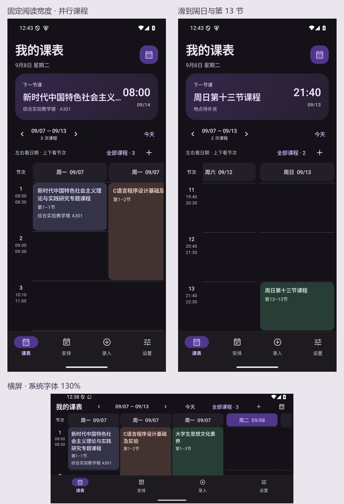

# v1.5.1 固定尺寸课表验证

本次针对七天压缩视图在重叠课程下把课名挤成竖排的实际反馈，改为固定阅读尺度和双向滚动。日期为 2026-09-08。

## 行为

每门并行课程固定 196dp 宽，课名 14sp、说明 12sp，保留系统字体缩放。横屏、屏幕宽度及重叠课程数量不会让课程变窄或字号变小；同一时段并行课程使当天横向展开。星期日期在每个并行列上重复，横向滑动到同一天较后位置仍可判断日期。

课名、地点、教师完整换行，不用省略号截断。所有节次使用同一高度，至少 128dp，根据本周最长内容和系统字体所需空间统一增加高度，保持跨天时段和连堂边界对齐。屏幕不必一次显示七天或全天；内容通过左右、上下滑动浏览。

顶部日期不随纵向滚动消失，左侧节次不随横向滚动消失。日期跳转和“今天”定位相应星期，切换主页面保留滚动状态。添加入口移到网格上方，避免遮挡最后一节；原展开/整周切换已移除。

## 测试证据

- 旧布局回归失败：同一时段三门课中，一张卡片宽度只有约 14.10dp，未满足至少 180dp 的可读性断言。
- Android 15：固定列宽、完整长标题、周日第13节双向定位、头部/刻度对齐、真实手势、课程增改删、连堂对齐、全部课程编辑返回及Widget入口检查通过。
- Android 7.0：固定布局与已有课表测试共8项通过，包含实际上下/左右手势。
- Android 15 横屏及系统字体130%：固定布局3项通过，标题没有视觉溢出，课程宽度不随滑动改变。
- 99项Kotlin单元测试通过，正式ARM签名构建及Release Lint通过。

主要回归为 `FixedTimetableTest`、`TimetableScreenTest`。截图来自原生Compose与演示数据，不包含用户提供的私人课表。固定列宽是dp阅读尺度，非锁定物理像素；长内容可能提高整周行高，不能把完整内容塞回一个手机屏幕。标题显示在卡片中的全文仍需将该列滑入视口。

本轮未重测OCR模型准确率、MCP、通知长期可靠性或所有厂商桌面行为。用户的澎湃OS4/Android17尚未在实体设备上直接验证；不以其他系统的通过结果替代实机结论。
