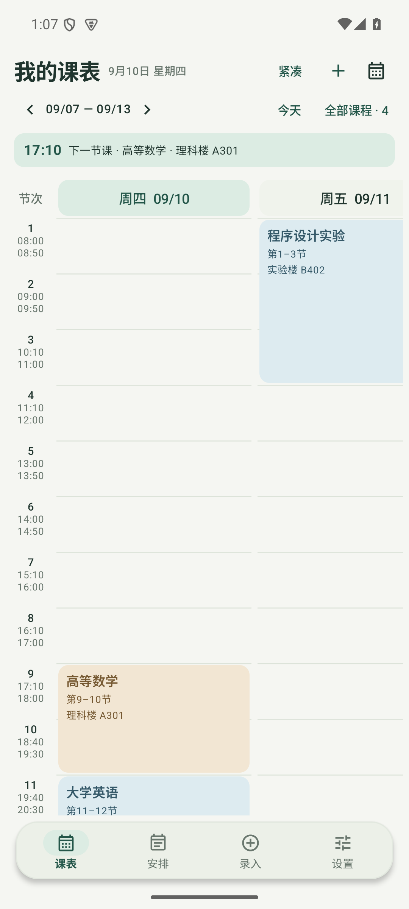

# v1.5.3 课表密度与底栏验证

本次针对三条反馈修改：课表留白过多、顶部 UI 占位过大、底栏横向过宽且图标被裁切，另外增大了桌面小组件内容与边框的间距。日期为 2026-09-10。

## 节次高度改为按内容分配

旧实现取全周最高的一张卡片，把同一个高度应用到所有节次，因此只要有一门课信息较长，整周的空节次都会被撑高。

新实现只把额外高度分配给该课程实际覆盖的节次，空节次保持最小高度（标准档 56dp、紧凑档 48dp 起）。所有天共用同一套行边界，因此同一时段的并行课程与连堂课程仍然对齐。高度由三部分组成：课名与信息行在固定列宽下的实测换行高度、卡片内边距、以及时间刻度必须容纳“节次 + 开始时间 + 结束时间”的最低高度。

课程卡片只渲染真实存在的信息：单节课程不再重复显示“第 X–X 节”，没有地点或教师时不会留下空行，单双周与周次范围仅在需要时出现。

## 顶部与底部占用

顶部从“大标题 + 大块当前课程卡 + 两行周导航”压成三行：标题与日期同一行，右侧是缩放、添加、跳转日期；第二行是周切换与“今天 / 全部课程”；第三行只在确实存在下一节课时显示单行摘要，没有课程时这一行不出现。

底栏改为居中的圆角窄条，宽度为屏幕宽度的 92%、上限 420dp，高度 58dp，并叠加系统手势区 inset。四个标签各占等宽槽位，图标 20dp、文字 11sp，不再出现槽位窄于图标的情况。

## 缩放档位

“标准”档每列固定 196dp，标题 13sp；“紧凑”档列宽为 70%，标题 12sp，长课名折行而不是把字号等比压小。实测标准档卡片宽 196dp，紧凑档 137dp，均通过“卡片宽度不小于可读阈值”与“标题无视觉溢出”的断言。

## 桌面小组件

内容区与圆角边框之间的左右内边距从 16/14/18dp 调整为 18/16/20dp，上下内边距从 2/6/14/18dp 调整为 3/7/15/17dp。五种尺寸 × 明暗主题 × 普通名称/长名称/空状态共 60 个组合的 RemoteViews 渲染仍然全部通过，未出现文字裁切。

## 证据

| 检查 | 结果 |
| --- | --- |
| 单元测试 | 从 ASCII 构建路径 `D:\kebiao-build\apk\android` 运行，全部通过 |
| Android 15 设备测试 | `FixedTimetableTest`、`TimetableScreenTest`、`EntryFlowTest`、`WidgetRenderTest` 共 14 项通过 |
| 双向滚动 | 左右滑动改变日期、上下滑动改变节次，星期标题与时间刻度保持对齐且不随另一个轴移动 |
| 连堂与末节 | 第 13 节课程可见，三节连堂卡片跨越三行且不覆盖下一行 |
| 实际界面 | 使用演示课程截图确认行高按内容分配、底栏为居中窄条、图标与文字完整 |

已知边界：按内容分配高度意味着某一节次被长课程撑高后，同一节次在其他天也会同步变高，这是保持时段对齐的必要代价。标准档一屏内的可见节次少于紧凑档。用户的澎湃 OS 4 / Android 17 实体设备仍未直接验证。

> 说明：中文工作区路径会让 Gradle 单元测试进程的类路径出现乱码，导致本项目测试类加载失败。因此单元测试需要从 ASCII 路径（`D:\kebiao-build\apk\android`，指向同一份源码的目录联接）执行。
