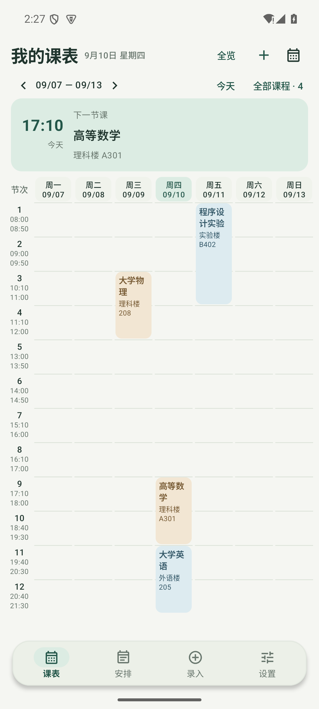
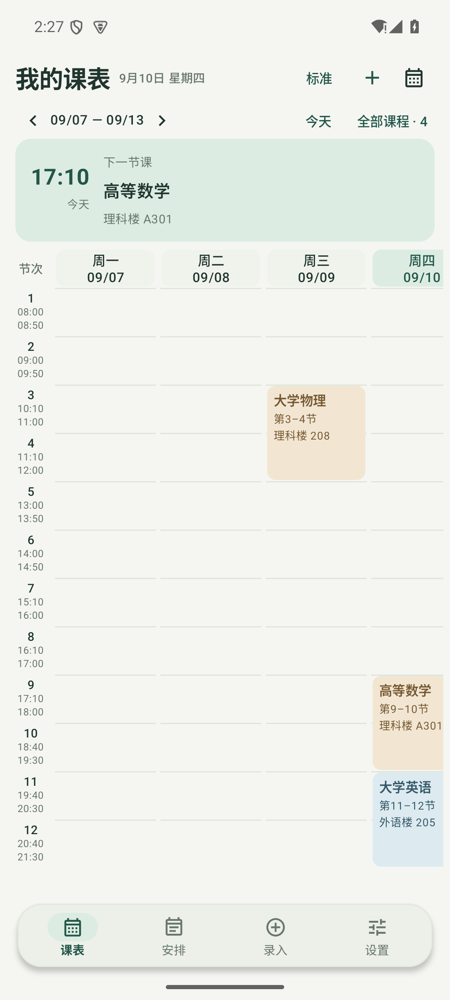

# v1.5.4 课表缩放与浏览方式验证

本次按反馈把每天的列进一步收窄，并把浏览方式明确成两种：**全览**（七天同屏）与**拖动**（列更宽时左右滑动），两者之间可以用双指捏合连续缩放。日期为 2026-09-10。

## 两种浏览方式

| 档位 | 列宽 | 标题字号 | 一屏可见天数 |
| --- | ---: | ---: | --- |
| 全览（默认） | 按屏宽自适应：411dp 屏约 49dp、360dp 屏约 42dp | 11sp | 7 天 |
| 标准 | 92dp | 12sp | 约 4 天 |
| 宽松 | 130dp | 13sp | 约 3 天 |

全览档不写死列宽，而是从视口宽度反算：扣除左侧节次栏、天与天的间隙和两侧留白后平分给七天，因此换屏幕宽度也不需要左右拖动就能整周入屏。标准与宽松档保留固定列宽，左右滑动看不同天，上下滑动看不同时段，表头与时间刻度跟随对应轴滚动。

右上角按钮显示当前档位，点按按“全览 → 标准 → 宽松 → 全览”循环；在课表上双指捏合可连续调整列宽（40–220dp），档位标签自动切到最接近的一档；捏到比全览更窄时吸附回全览，保证七天完整入屏。

## 卡片与行高

- 全览档的课程卡片只显示真实存在的信息：卡片高度已经表达了跨几个节次，因此不再重复“第 X–Y 节”，单双周标记仍然保留。
- 行高按内容分配，并把卡片自身的 1dp 内缩与行间距计入需求。这正是 Android 7 文本折行更保守时，窄列长课名被裁掉两个像素的修复点。
- 课名在窄列中按内容折行，断言使用 `TextLayoutResult.hasVisualOverflow == false`，而不是只看卡片宽度。

## 与前一版的差异

v1.5.3 只提供固定的“标准 / 紧凑”两档，且默认档一屏只能看到约两天。本次把默认改成七天同屏的全览档，把可拖动档统一为 92dp / 130dp，并补上双指捏合与吸附回全览的行为。

## 验证证据

| 检查 | 结果 |
| --- | --- |
| 单元测试 | 从 ASCII 构建路径 `D:\kebiao-build\apk\android` 运行，全部通过 |
| Android 15（API 35，411dp） | UI、数据、MCP、提醒与小组件共 55 项全部通过 |
| Android 7.0（API 24，360dp） | 同一套 55 项全部通过，覆盖窄屏与旧文本折行行为 |
| 全览档 | `day-header-1`…`day-header-7` 同时可见，列宽断言 ≤56dp |
| 双指缩放 | 捏合后列宽按倍率放大并切换档位标签；反向捏合吸附回全览，七天重新完整入屏 |
| 拖动浏览 | 左右滑动改变日期、上下滑动改变节次，卡片宽度不变，表头与时间刻度保持对齐 |
| 实际界面 | 截图为演示课程在 Android 15 上的真实渲染 |

## 已知边界

- 全览档在 360–411dp 宽度下每列约 42–49dp，长课名会折成 2–3 字一行；需要更舒展的阅读体验时切到标准或宽松档。
- 捏合只改变列的宽度；节次高度仍按内容计算，因此同一节次被长课程撑高时其他天同步变高，这是保持时段对齐的必要代价。
- 用户的澎湃 OS / Android 17 实体设备仍未直接验证。

> 说明：中文工作区路径会让 Gradle 单元测试进程的类路径出现乱码，导致本项目测试类加载失败。因此单元测试需要从 ASCII 路径（`D:\kebiao-build\apk\android`，指向同一份源码的目录联接）执行。
