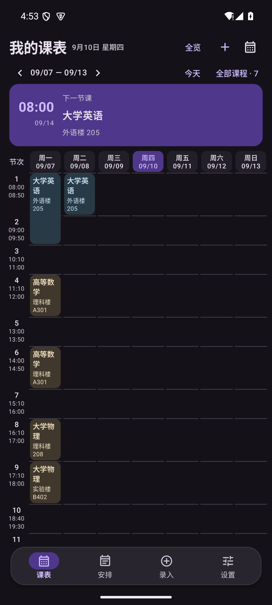
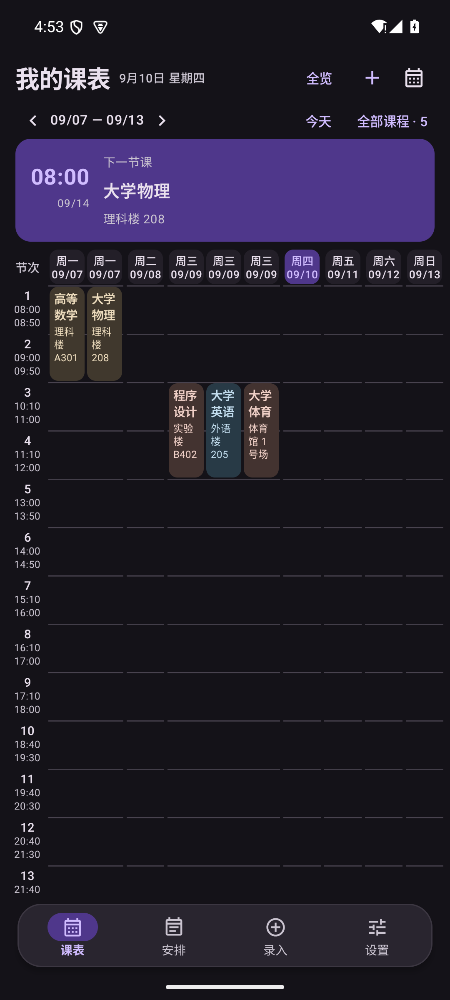

# v1.6.0 连堂合并与整周入屏验证

本次按反馈处理两件事：同一天连续节次的同一门课自动合并，以及最窄档必须整体显示七天。日期为 2026-09-11。

## 连续同门课自动合并

按天把“课名、教学楼、教室、地点备注、教师、周次、单双周、课程备注”全部相同、并且节次首尾相接的记录合成一张卡片：

| 记录 | 结果 |
| --- | --- |
| 第 1 节 + 第 2 节《大学英语》，教室相同 | 一张跨两节的卡片 |
| 第 4 节 + 第 6 节《高等数学》，中间缺第 5 节 | 两张卡片 |
| 第 8 节《大学物理》理科楼 208 + 第 9 节《大学物理》实验楼 B402 | 两张卡片（教室不同） |
| 周一《大学英语》+ 周二《大学英语》 | 两张卡片（不同天） |

合并只发生在显示层。卡片点击时传回的是原来的单节记录，因此编辑弹窗显示“第 1–1 节”，保存也不会把合并跨度写回数据库；“全部课程”列表和桌面小组件读取的仍是原始记录。



## 最窄档整周入屏

旧实现假定每天只有一列，按“视口宽度 ÷ 7”算列宽。某天存在并行课程时会多出一列，内容总宽超出视口，最后一到两个星期会被挤出屏幕，必须横向拖动才能看到。

现在列宽按当周真实列数反算：

```
列宽 = (视口宽度 − 两侧内边距 − 节次栏宽度 − 天间隙 × 6) ÷ 星期内所有分栏总数
```

例如 411dp 屏幕上，两个并行日的 10 列会把列宽收到约 34dp，七天仍然全部落在屏内；列宽下限 24dp，只有极端并行数量才会退回滚动。



## 验证证据

| 检查 | 结果 |
| --- | --- |
| 单元测试 | 从 ASCII 构建路径 `D:\kebiao-build\apk\android` 运行，全部通过 |
| Android 15（API 35，411dp） | UI、数据、MCP、提醒与小组件共 60 项全部通过 |
| Android 7.0（API 24，360dp） | 同一套 60 项全部通过 |
| 合并断言 | 相接的两节只剩一张卡片且高度大于单节卡片的 1.5 倍；缺节、换教室、换星期都不合并；点击合并卡片后弹窗显示“第 1–1 节” |
| 整周入屏断言 | 周一 2 栏、周三 3 栏（共 10 列）时，七个星期表头的右边界都在课表范围内，周日表头可见 |
| 反向验证 | 把列宽改回“÷ 7”后，整周入屏断言立即失败，说明它确实覆盖了这次修复 |

## 已知边界

- 合并后卡片的信息按合并跨度显示（拖动档会显示“第 X–Y 节”），但编辑仍针对单节记录；若希望把连堂真正合并成一条数据，需要在编辑器里手动改成跨节课程。
- 并行分栏越多，最窄档的列宽越窄；四栏以上时列宽会收到 30dp 以下，此时建议切到标准档。
- 用户的澎湃 OS / Android 17 实体设备仍未直接验证。
