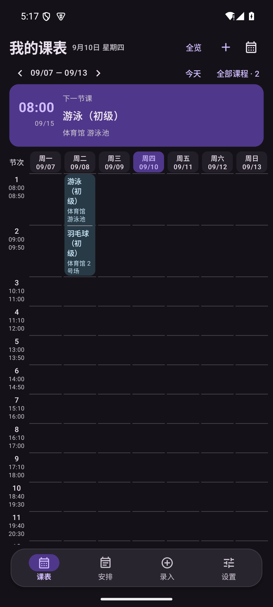

# v1.6.1 最窄档可读性修复验证

1.6.0 为了“整周入屏”把最窄档列宽改成按并行列总数反算，遇到并行课程多的课表会把每列压到 20 多 dp：日期折成“09/0 / 7”，教学楼与教室被挤出卡片。本次按反馈改成每天固定一列，并将冲突课程合并到列内。日期为 2026-09-11。

## 改法

| 项目 | 1.6.0 | 1.6.1 |
| --- | --- | --- |
| 最窄档列宽 | （视口 − 其他）÷ 并行列总数，最低 24dp | （视口 − 其他）÷ 7，最低 38dp；411dp 屏约 49dp |
| 并行课程 | 每天并排多列，整周被挤宽 | 每天固定一列，冲突课程在同一列内合成一张卡片，逐条列出课名与地点 |
| 日期表头 | 单行文本被拆行，出现“09/0 / 7” | 拆成“周几”“日期”两个单行标签并禁止换行 |
| 拖动档 | 并排分栏 | 不变，仍并排分栏，方便对照 |

冲突合并只发生在最窄档：标准与宽松档仍按分栏并排显示，数据本身没有任何改动，点击卡片编辑的仍是第一节记录。

## 验证证据

| 检查 | 结果 |
| --- | --- |
| 单元测试 | 从 ASCII 构建路径 `D:\kebiao-build\apk\android` 运行，全部通过 |
| Android 15（API 35，411dp） | UI、数据、MCP、提醒与小组件共 61 项全部通过 |
| Android 7.0（API 24，360dp） | 同一套 61 项全部通过 |
| 一天一列断言 | 有冲突的周二与无冲突的周一列宽一致（差值 < 1dp），七个表头全部可见 |
| 冲突信息断言 | 冲突卡片内同时显示两门课名与两处地点（体育馆 游泳池 / 体育馆 2号场），卡片宽度不超过一天一列 |
| 切档断言 | 切到标准档后同一天恢复为两条分栏（>150dp），说明缓存已按档位刷新 |
| 实际界面 | 截图为真机（模拟器）渲染，日期完整、地点完整、七天同屏 |

## 已知边界

- 冲突课程在最窄档里按列内堆叠展示，卡片会因内容变高，所在节次的行高同步变高（各天共用行边界）。
- 一天内冲突很多时建议切到标准档查看并排对照。
- 用户的澎湃 OS / Android 17 实体设备仍未直接验证。
