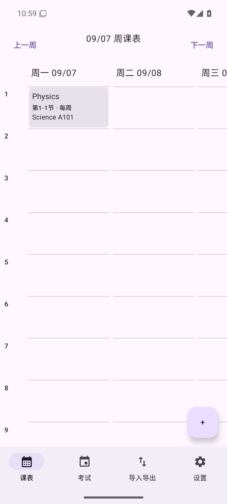

# 原生数据写入与设备验证

日期：2026-09-07。

## 已修正的问题

- 普通课程、考试、调休编辑原先用尚未完整加载的界面快照替换整库，可能删除其他记录。现在按记录写入、删除，成功后的 Room 数据流更新界面；写入失败显示错误。
- MCP 添加课程改为调用仓库的单条写入，不再读取后覆盖整个数据集。仓库验证失败会转换为请求错误。这不代表 MCP 协议已经完整实现。
- 图片课程追加使用独立事务，ID 冲突时整批回滚。普通编辑保留创建时间并更新修改时间；数据库快照在事务中读取。
- JSON 导入拒绝无效记录、错误的数组类型和未知周次；完整替换前检查重复 ID、日期与时间。界面先确认替换，事务完成后才显示成功。
- Activity 共享一个 Room 实例，避免界面重建时反复创建数据库连接。
- 实际启动截图发现旧启动主题残留标题栏、异常背景和重复顶部间距，已通过 SplashScreen 的运行时主题切换及消费窗口间距修复。
- 实际编辑发现课程落库后周视图不立即刷新，已改为向日视图传递课程列表，并用 Compose 设备测试覆盖。
- 课程卡片按固定节次位置绘制，连堂课不会挤动后续课程；同时段课程使用并列位置，支持垂直和水平滚动，卡片使用紧凑文本与 6 dp 圆角。

## 环境与证据

- 沿用 Microsoft JDK 21、Gradle wrapper 8.14.3、Android SDK `D:\Android\Sdk`。
- 本轮安装官方 Android Emulator 和 Android 15 Google APIs x86_64 镜像 revision 9。
- 虚拟设备：`ClassSchedule_API35`，Pixel 6 配置，`D:\Android\Avd`，WHPX 加速，2048 MB 内存。
- 镜像来源由 Google SDK 仓库确定，镜像压缩包约 1.74 GB；未重新安装 JDK 或 Android Studio。
- 安装并测试后 C/D 盘约剩余 40.4/69.4 GB。

在 `D:\kebiao-build\apk\android`，设置正确的 `JAVA_HOME` 和 `ANDROID_SDK_ROOT` 后运行：

```powershell
.\gradlew.bat :app:testDebugUnitTest :app:assembleDebug :app:assembleDebugAndroidTest --no-daemon --console=plain
.\gradlew.bat :app:connectedDebugAndroidTest --no-daemon --console=plain
```

JVM 测试：33 项通过。最终 Android 设备测试：9 项通过，0 failures、0 errors，Gradle 返回 `BUILD SUCCESSFUL in 48s`。

设备测试覆盖数据库插入观察、追加保留其他数据、并发编辑、批次回滚、非法替换保留旧数据、首次加载前编辑、Compose 页面即时增删改、连堂课对齐、同时段课程显示，以及原生启动入口解析。

实际操作另外确认：

1. 在最终调试 APK 中输入并保存 `Physics`，教学楼 `Science`、教室 `A101`。
2. 保存后不切换页面，课程立即可见。
3. 强制关闭进程后重新启动，课程仍然存在。
4. 向下滚动可看到第 12 节。
5. 截图复查单节课程名称、节次、周次和地点完整显示；已检查的启动和保存流程中 crash logcat 无输出。



生成的设备报告在 `apk/android/app/build/outputs/androidTest-results/connected/debug/`，本机过程截图在 `apk/android/app/build/qa/`。

## 运行说明

虚拟设备存放在 D 盘，可在 PowerShell 指定其目录后启动；Android Studio 也需要从配置了相同 `ANDROID_AVD_HOME` 的环境启动才能找到它：

```powershell
$env:ANDROID_AVD_HOME='D:\Android\Avd'
& 'D:\Android\Sdk\emulator\emulator.exe' -avd ClassSchedule_API35 -gpu swiftshader -memory 2048
```

本轮测试采用无窗口模式。Gradle connected 测试会卸载测试用应用；需要保留交互样例时，应在测试完成后重新安装调试 APK。本轮已按此方式重新安装和检查。

## 仍未完成的验收

本记录证明上述数据与界面流程，不代表整体开发结束。真实通知可靠性、小组件刷新、本地 OCR 按需下载和推理、真实 OpenAI 图片调用、标准 MCP 客户端互操作、完整 Web 双向迁移、数据集元信息持久化和大字体/横屏布局仍需继续完成或验证。

清理本轮 1 KB 下载探针 `D:\Android\Sdk\.temp\image-download-probe.bin` 被自动审批策略拒绝，暂时保留。模拟器镜像和 AVD 为后续验证继续使用的环境文件。
